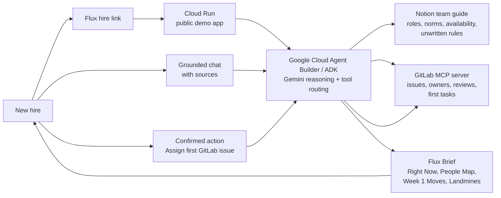
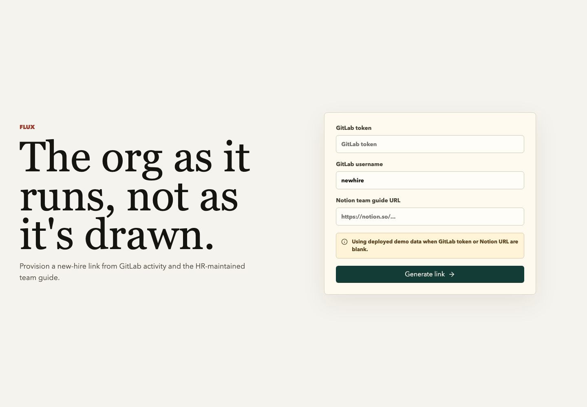
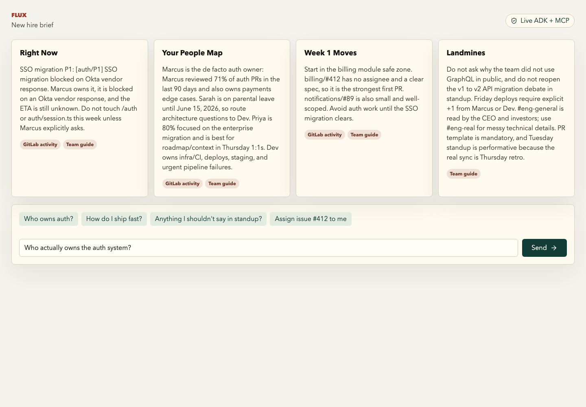
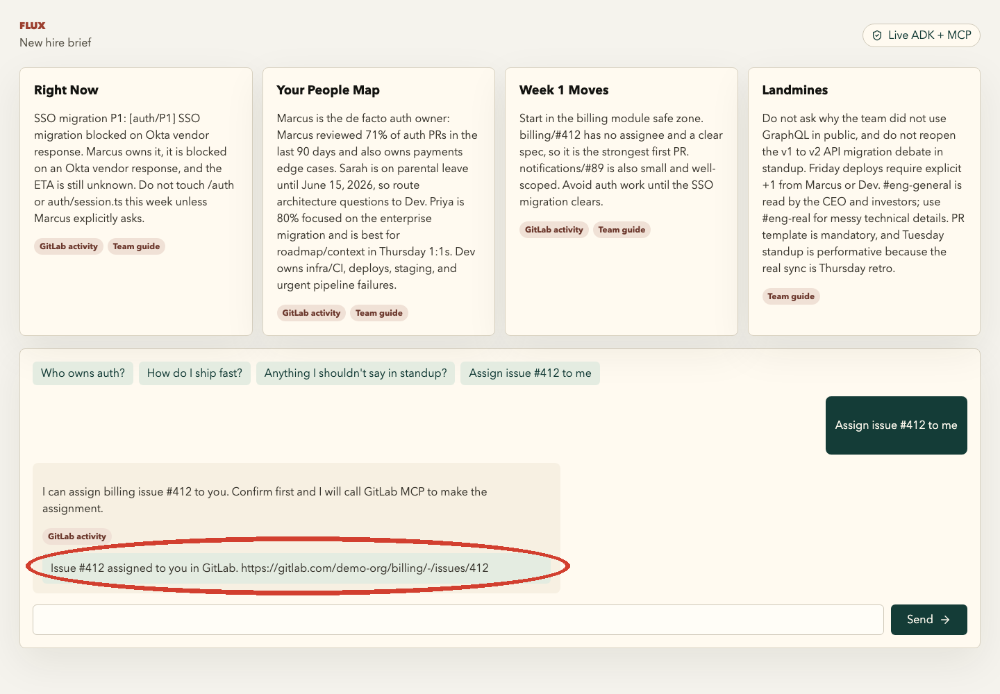

# Flux

The org as it runs, not as it is drawn.

Flux is a Google Cloud Rapid Agent Hackathon project for onboarding engineers into GitLab-based teams. It reads GitLab activity and an HR-maintained Notion guide, generates a day-one brief, answers grounded onboarding questions, and can assign a first GitLab issue after explicit confirmation.

## Why Flux Exists

Onboarding today is mostly a static promise: a PDF, a wiki page, a few links, and a manager saying "just ask around." That material is usually stale before the new hire reads it. It describes the official org chart, but not the real operating system of the company: who actually reviews auth, which migration is politically sensitive, who is on leave, which Slack channels are performative, and which first task is safe.

The missing layer is **ground truth**. Companies already have it, but it is scattered across the work systems people use every day:

- GitLab knows what is actually changing, who reviews it, which issues are open, and where the safe first contribution lives.
- Notion knows the human context: team norms, availability, unwritten rules, meeting culture, and current priorities.
- Cloud Run and Google Cloud Agent Builder make that context available as a live, grounded agent instead of another stale document.

The beachhead is engineering onboarding for GitLab-based teams, but the broader TAM is workforce onboarding for every company whose work truth is split across collaboration tools. Every new engineer, support rep, operator, analyst, and manager needs the same thing on day one: not an org chart, but the living map of how the team works.

## Workforce Components

Flux is built for a modern company where HR and team leads maintain Notion, engineers work in GitLab, and new hires need a usable first-day experience without getting access to every internal system immediately.



From the new hire's point of view, Flux is a single link. Behind the scenes, it grounds every answer in the systems the company already trusts.

## Screenshots

### Setup With Demo Data

Flux states that it is using deployed demo data.



### New-Hire Brief

The generated brief tells the Marcus/auth/SSO story, safe first issues, people map, and unwritten rules.



### Move Beyond Chat

Flux proposes a first real task and only writes to GitLab after confirmation.



## Live Demo

- App: https://flux-153593352872.us-central1.run.app
- Health check: https://flux-153593352872.us-central1.run.app/api/health
- Cloud Run service: `flux`
- Region: `us-central1`
- Current revision verified: `flux-00010-vr5`

The setup page can be used with blank fields for the hackathon demo. Blank values create a workspace that uses deployed server-side configuration for live Notion, GitLab MCP, and Gemini/ADK orchestration.

## What It Does

1. HR opens Flux and generates a unique new-hire link.
2. The new hire opens `/onboard/{workspace_id}`.
3. Flux shows a four-part brief:
   - `Right Now`: live blockers and what to avoid this week.
   - `Your People Map`: who actually owns which systems.
   - `Week 1 Moves`: safe first tasks.
   - `Landmines`: unwritten rules from the team guide.
4. The new hire asks follow-up questions with source attribution.
5. When the new hire asks to take issue `#412`, Flux proposes a GitLab assignment and waits for confirmation before writing.

## Current Build Status

Implemented and verified:

- React + TypeScript + Vite frontend.
- FastAPI backend served from one Cloud Run service.
- Public Cloud Run deployment.
- Secret Manager wiring for GitLab and Notion tokens.
- Notion page ingestion with fixture fallback.
- GitLab issue ingestion through the official GitLab CLI MCP server (`glab mcp serve`).
- Confirmed GitLab issue assignment through the MCP `glab_issue_update` tool.
- Google Cloud Agent Builder orchestration via the ADK Python SDK (`google.adk.agents.LlmAgent` + `google.adk.runners.Runner`), with Gemini as the reasoning layer and GitLab MCP registered as a callable toolset.
- Source attribution in the brief and chat.
- Explicit action confirmation before any GitLab write.

Important honesty for judges and reviewers:

- `FLUX_AGENT_MODE=live` is the current deployed mode.
- `GEMINI_MODEL=gemini-2.0-flash` is configured as the primary model, with `GEMINI_FALLBACK_MODEL=gemini-2.5-flash` because this Google Cloud project currently returns Vertex 404s for the Gemini 2.0 Flash model in the tested locations.
- Agent orchestration uses **Google Cloud Agent Builder** via the ADK Python SDK (`LlmAgent` + `Runner`) with the GitLab MCP server registered as a toolset. Deployed on Cloud Run rather than Vertex AI Agent Engine — both are valid Google Cloud deployment targets for ADK agents.
- Confirmed write actions are executed only after explicit user confirmation.

## Architecture

```text
React setup page
  -> POST /api/setup
  -> returns /onboard/{workspace_id}

React onboarding page
  -> GET /api/brief/{workspace_id}
  -> Notion API or fixture guide
  -> GitLab MCP issue reads via glab mcp serve
  -> Google ADK + Gemini synthesis
  -> Flux Brief

Chat
  -> POST /api/chat
  -> Google ADK + Gemini grounded answer with sources
  -> optional action proposal

Confirmed action
  -> POST /api/action/confirm
  -> GitLab MCP glab_issue_update assignment if live GitLab env vars are present
```

## Repository Layout

```text
backend/
  main.py                  FastAPI app and static frontend serving
  routes/                  setup, brief, chat, action confirmation
  services/                ADK agent, Notion, GitLab MCP, influence graph, fallback intelligence
  demo_data/               deterministic fallback data
  tests/                   backend test suite

frontend/
  src/pages/               setup and onboarding pages
  src/components/          brief, chat, source chips

docs/
  DEMO_SCRIPT.md           3-minute video and live demo script
  HANDOFF.md               current state for another coding agent
```

## Local Development

Create `.env` from `.env.example` and fill values as needed. Tokens must stay in `.env` or Secret Manager, never in git.

Install GitLab CLI locally before running live MCP mode:

```bash
brew install glab
```

Start the backend:

```bash
cd backend
python3 -m venv .venv
source .venv/bin/activate
pip install -r requirements.txt
uvicorn main:app --reload --port 8000
```

Start the frontend:

```bash
cd frontend
npm install
npm run dev
```

Open:

```text
http://localhost:5173
```

The Vite dev server proxies `/api` to `http://localhost:8000`.

## Test And Build

Backend:

```bash
backend/.venv/bin/pytest backend/tests -v
```

Frontend:

```bash
cd frontend
npm run build
```

Container build path:

```bash
docker build -t flux .
```

This shell currently does not have Docker installed, so local container build verification may need to happen in Cloud Build.

## Cloud Run Deployment

The deployed service uses Cloud Run source deployment and Secret Manager. Example command shape:

```bash
gcloud run deploy flux \
  --source . \
  --region us-central1 \
  --allow-unauthenticated \
  --set-env-vars "GOOGLE_CLOUD_PROJECT=$GOOGLE_CLOUD_PROJECT,GOOGLE_GENAI_USE_VERTEXAI=True,GOOGLE_CLOUD_LOCATION=us-east4,GEMINI_MODEL=gemini-2.0-flash,GEMINI_FALLBACK_MODEL=gemini-2.5-flash,GITLAB_USERNAME=$GITLAB_USERNAME,GITLAB_PROJECT_URL=$GITLAB_PROJECT_URL,NOTION_PAGE_URL=$NOTION_PAGE_URL,FLUX_AGENT_MODE=live,FLUX_BASE_URL=$FLUX_BASE_URL,GLAB_COMMAND=glab" \
  --set-secrets "GITLAB_TOKEN=flux-gitlab-token:latest,NOTION_TOKEN=flux-notion-token:latest"
```

Required public access for judging:

```text
allUsers -> Cloud Run Invoker -> service flux
```

## Demo Resources

- Demo script: `docs/DEMO_SCRIPT.md`
- Handoff notes: `docs/HANDOFF.md`
- Roadmap: `docs/ROADMAP.md`
- Notion guide shape: see `backend/demo_data/notion_page.md`
- GitLab demo issue flow: ask `Assign issue #412 to me`, then click `Confirm assignment`

## Submission Checklist

- Cloud Run URL is public and healthy.
- GitHub repo is switched from private to public before final submission.
- MIT license remains present.
- Demo video is under 3 minutes.
- GitLab partner track is selected.
- README explains the live ADK, Gemini, GitLab MCP, Notion, and Cloud Run architecture.
